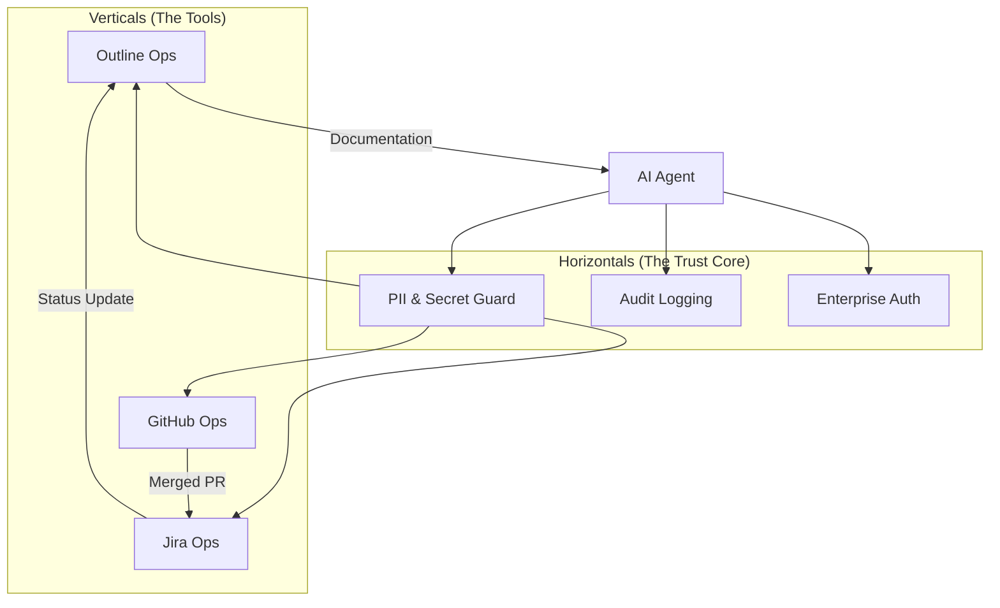

# Architecture: The EngOps Matrix

This document explains how the Verticals and Horizontals of the EngOps Agent Skills suite interact to create a high-trust automated environment.

## The Matrix Model

## Data Flow & Safety

1.  **Request**: The Agent intends to take an action (e.g., "Summarize this PR in Outline").
2.  **Scrubbing (H1)**: The input data passes through the `pii-guard`. Hardcoded tokens or emails are masked.
3.  **Verification (H3)**: The agent verifies it has the least-privilege token required for the vertical.
4.  **Invocation (V1-3)**: The tool call is made to the specific REST/GraphQL API.
5.  **Logging (H2)**: On success, a JSON audit log is appended to the local audit trail for security review.

## Multi-Skill Synergies

Our "Playbooks" are the glue that turns individual tools into a system. By sharing the same **Horizontal Core**, an agent can safely move data from a GitHub PR description (potentially containing logs/secrets) into a public Wiki document by applying the `pii-guard` in the middle.

---

*Foundations for the future of Engineering Management.*
